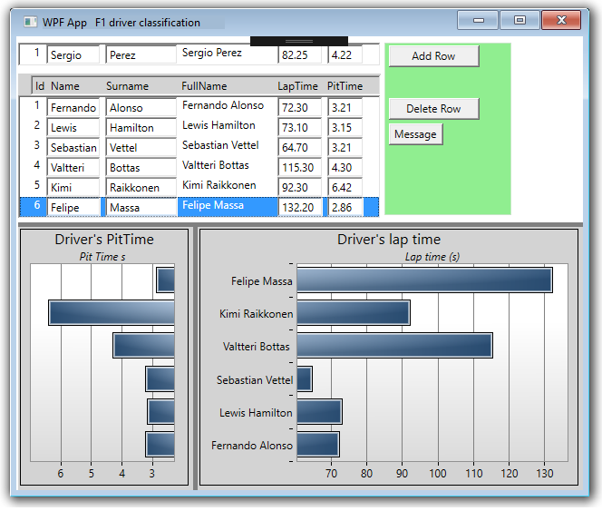

# WPF MVVM BarCharts

A WPF application with MVVM pattern with a bar charts and RelayCommands
The application demonstrates the use of the MVVM pattern for simple CRUD operations.
Example Data [Database] is stored in rows of Collections [ObservableCollection]. This data is connected to graphical controls and a ListBox array. Operations in the array automatically change the database and bar charts. 
An intermediate abstract class [abstract class CObservable : INotifyPropertyChanged] is used. The class does a simple definition of the data in the row (usually the User class). It makes the get, set fields have only one line each. Maybe it can be written even simpler.
A central class was also used: [RelayCommand : ICommand] for universal messaging.
In another place I have the simplest application to use the MVVM pattern.

## CRUD operations:
Adding data (Create);
Drawing charts (Read);
Editing data (Update);
Deleting data (Delete);

## Details
VS2017 and Target Framework: .NET Framework 4.6.1

 

